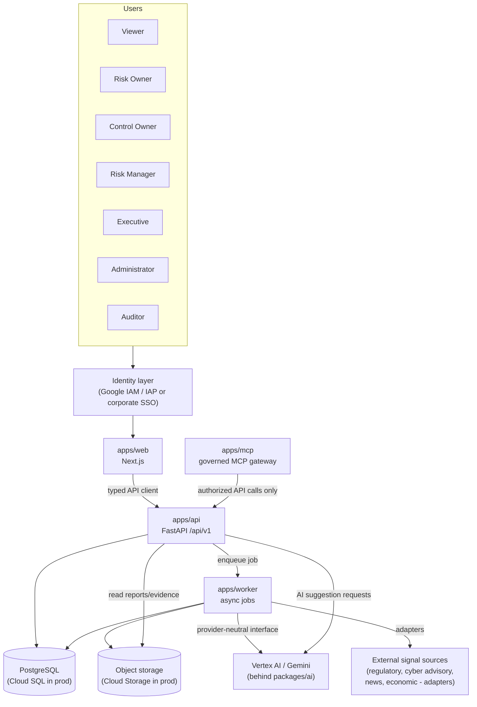
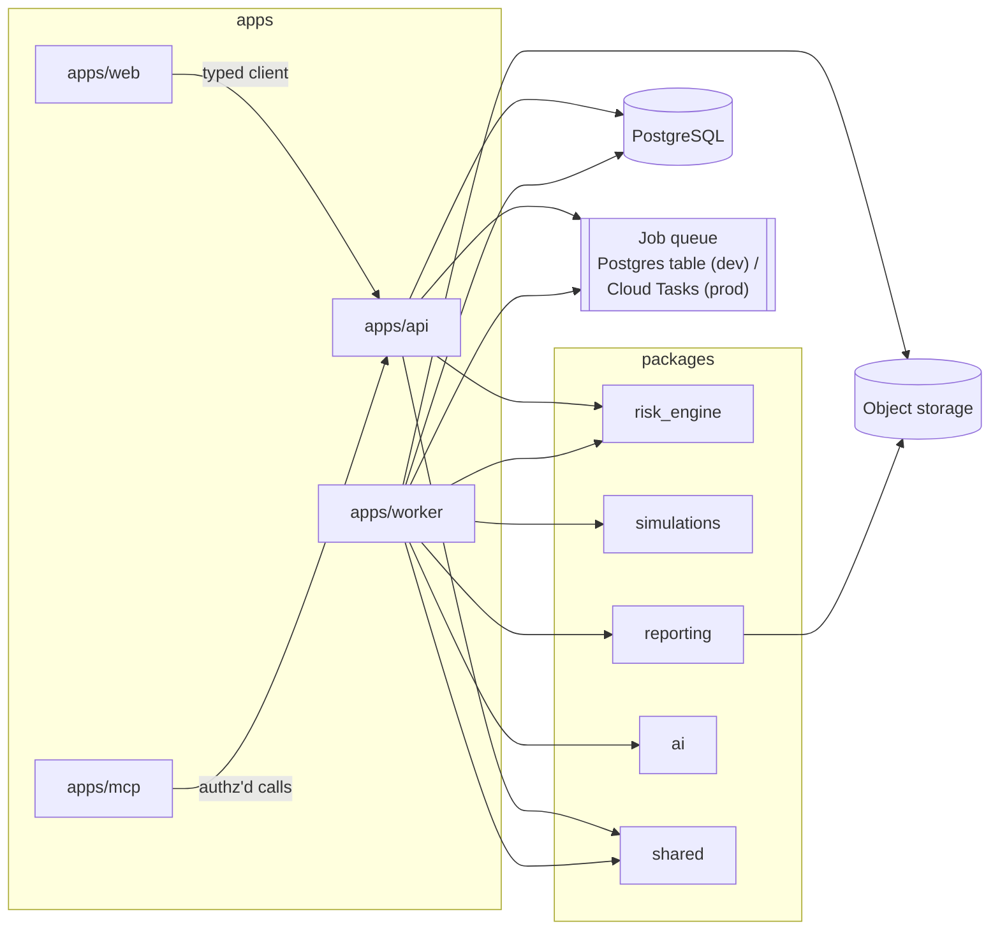

# Target Architecture

## Principles

1. **Sync API, async work.** `apps/api` answers CRUD/read requests synchronously. Anything
   expensive or slow (Monte Carlo, PPTX/PDF generation, AI calls, emerging-signal ingestion,
   snapshot computation) is enqueued as a job and executed by `apps/worker`. The API returns
   `202 Accepted` plus a job/run ID; the client polls or is notified.
2. **Deterministic core, AI at the edges.** Risk scoring, appetite evaluation, and priority
   ranking are pure, config-driven, unit-tested functions in `packages/risk_engine`. AI
   (`packages/ai`) only ever produces *suggestions* that a human approves before they become
   authoritative data.
3. **One domain model, many sources.** The database schema is the internal domain model. It
   never depends on the shape of an external spreadsheet, an AI provider's response, or an
   emerging-risk feed. Everything external comes in through an explicit mapping/adapter layer.
4. **Everything authoritative is audited.** Every write to authoritative data emits an
   `audit_events` record; risks additionally carry `risk_history` for point-in-time
   reconstruction and `version` for optimistic concurrency.
5. **Same code, two environments.** Local development (Docker Compose, mock AI provider,
   fixture emerging-risk sources, a Postgres-backed job queue) and production (Cloud Run,
   Cloud SQL, Vertex AI, Cloud Tasks) run the *same application code* against swappable
   infrastructure adapters — never a different code path per environment.
6. **No public production API.** Production access is via authenticated web app (SSO/IAP) and
   governed MCP gateway only; the API itself is not internet-exposed without an identity layer
   in front of it.

## System context

## Container view

`packages/shared` (models, audit writer, storage abstraction, import-mapping layer, RBAC
primitives, logging) is depended on by both `apps/api` and `apps/worker`, so the two never
diverge on schema or validation rules.

## Synchronous vs. asynchronous boundary

| Operation | Path | Why |
|---|---|---|
| Risk/control/action CRUD, reads, dashboard queries | API, synchronous | Fast, bounded queries. |
| Import Wizard: inspect columns, preview, validate | API, synchronous | Bounded to one file's rows; still fast enough for a request. |
| Import Wizard: commit (large file) | API enqueues, worker commits, API returns job status | Row count is unbounded; must not block the request thread. |
| Monte Carlo (risk-level or portfolio) | API enqueues, worker runs, client polls `simulation_runs` | Iteration counts (10k–1M+) are too slow for a request. |
| PDF/PPTX generation | API enqueues, worker renders, result in object storage | Rendering is CPU-bound and can be slow with many risks. |
| AI suggestion generation | API enqueues (or synchronous with a strict timeout for short prompts), worker/`packages/ai` calls provider, result persisted as `ai_suggestions` pending review | Provider latency is variable and must not block user-facing requests; also keeps a durable, auditable record regardless of API request lifecycle. |
| Emerging-signal ingestion/classification | Scheduled job (Cloud Scheduler → Cloud Tasks in prod; cron-like scheduler in dev) → worker | Runs on a schedule against external sources, not in response to a user request. |
| Snapshot computation | Scheduled job → worker | Periodic, not user-request-driven. |

## Local development vs. production mapping

| Concern | Local development | Production |
|---|---|---|
| Compute | Docker Compose services (`web`, `api`, `worker`) | Cloud Run services (`web`, `api`, `worker`) |
| Database | PostgreSQL container | Cloud SQL for PostgreSQL |
| Object storage | Local filesystem volume behind the storage abstraction | Cloud Storage behind the same abstraction |
| Job queue | Postgres-backed table, worker polls with `SELECT ... FOR UPDATE SKIP LOCKED` | Cloud Tasks queues |
| Scheduler | `apps/worker` cron-style internal scheduler (e.g. APScheduler) or a `make` target | Cloud Scheduler → Cloud Tasks |
| AI provider | `MockAIProvider` (deterministic canned/templated responses) | `VertexGeminiProvider` via Vertex AI |
| Emerging-risk sources | Fixture adapters (static JSON/YAML fixtures) | Adapters for approved external sources |
| Secrets | `.env` file, git-ignored, never committed | Secret Manager, referenced by Cloud Run service config |
| AuthN/AuthZ | Local mock-auth (seeded users with role claims) for developer convenience | Google Identity / IAP or approved corporate SSO in front of `web`; service-to-service calls via IAM |
| Identity between services | Shared network within Compose | IAM-authenticated service-to-service calls (Cloud Run invoker roles), private ingress |
| Infra provisioning | None (Compose only) | Terraform (`infra/`), applied from the separate corporate Windows workstation |

This mapping means Milestone 1–10 work is fully buildable and testable in this Mac-only
development environment without any GCP access, credentials, or Terraform apply — consistent
with the constraint that this machine is development-only and production deployment happens
from a separate corporate workstation.

## Data classification and storage boundary

Risk data (risk statements, financial impact figures, control weaknesses, incident details)
is treated as **confidential enterprise data** end-to-end: at rest in Cloud SQL and Cloud
Storage (encrypted by default, plus column-level care for anything sensitive), in transit
(TLS everywhere, private Cloud Run ingress in production), and in use (AI prompts carry only
the minimum risk fields needed for the requested analysis — never credentials, never raw
database dumps; see `docs/security/threat-model.md`).
