# Entity-Relationship Diagram

Attributes are trimmed to primary/foreign keys plus a few defining columns for legibility —
full column lists are in `docs/architecture/02-domain-model.md`. Import-layer tables
(`import_jobs`, `import_column_mappings`, `import_row_errors`) are omitted here since they
are staging tables, not part of the authoritative domain graph.

```mermaid
erDiagram
    USERS ||--o{ USER_ROLES : has
    ROLES ||--o{ USER_ROLES : grants

    RISK_CATEGORIES ||--o{ RISKS : classifies
    USERS ||--o{ RISKS : owns
    USERS ||--o{ RISKS : "is accountable executive for"

    RISKS ||--o{ RISK_ASSESSMENTS : "assessed via"
    RISK_ASSESSMENTS ||--o{ RISK_IMPACT_SCORES : "scored on"
    RISKS ||--o{ RISK_HISTORY : "versioned as"
    RISK_CATEGORIES ||--o{ RISK_APPETITE : "bounds"

    RISKS ||--o{ RISK_CONTROLS : "mitigated by"
    CONTROLS ||--o{ RISK_CONTROLS : mitigates
    CONTROLS ||--o{ CONTROL_ASSESSMENTS : "assessed via"
    CONTROLS ||--o{ CONTROL_TESTS : "tested via"

    RISKS ||--o{ ACTIONS : "treated via"
    RISKS ||--o{ ISSUES : "raised against"
    CONTROLS ||--o{ ISSUES : "raised against"
    ISSUES ||--o{ ACTIONS : generates
    RISKS ||--o{ INCIDENTS : "impacts"
    CONTROLS ||--o{ INCIDENTS : "failed in"

    SNAPSHOTS ||--o{ SNAPSHOT_RISKS : captures
    RISKS ||--o{ SNAPSHOT_RISKS : "captured at"

    SCENARIOS ||--o{ SCENARIO_RISKS : affects
    RISKS ||--o{ SCENARIO_RISKS : "affected by"

    RISKS ||--o{ SIMULATION_CONFIGS : "configured for"
    SCENARIOS ||--o{ SIMULATION_CONFIGS : "configured for"
    SIMULATION_CONFIGS ||--o{ SIMULATION_RUNS : executes
    SIMULATION_RUNS ||--|| SIMULATION_RESULTS : produces

    EMERGING_SIGNALS ||--o{ EMERGING_RISK_CANDIDATES : "gives rise to"
    RISKS ||--o{ EMERGING_RISK_CANDIDATES : "linked to (optional)"

    RISKS ||--o{ AI_RUNS : "analyzed via"
    AI_RUNS ||--o{ AI_SUGGESTIONS : yields
    RISKS ||--o{ AI_SUGGESTIONS : "targets (optional)"

    REPORTS ||--o{ REPORT_RUNS : generates

    RISKS ||--o{ AUDIT_EVENTS : "audited as entity"
    CONTROLS ||--o{ AUDIT_EVENTS : "audited as entity"
    ACTIONS ||--o{ AUDIT_EVENTS : "audited as entity"

    USERS {
        uuid id PK
        string email
        string sso_subject
        string status
    }
    ROLES {
        uuid id PK
        string name
    }
    USER_ROLES {
        uuid user_id FK
        uuid role_id FK
        uuid department_scope
    }
    RISK_CATEGORIES {
        uuid id PK
        string name
        uuid parent_id FK
    }
    RISKS {
        uuid id PK
        string risk_code
        string title
        uuid category_id FK
        uuid owner_id FK
        uuid accountable_executive_id FK
        string status
        string decision
        int residual_score
        string residual_band
        int version
    }
    RISK_ASSESSMENTS {
        uuid id PK
        uuid risk_id FK
        int likelihood
        int inherent_score
        int residual_score
        uuid scoring_config_version FK
        timestamp assessed_at
    }
    RISK_IMPACT_SCORES {
        uuid id PK
        uuid assessment_id FK
        string dimension
        int score
    }
    RISK_HISTORY {
        uuid id PK
        uuid risk_id FK
        int version
        jsonb field_state
        timestamp recorded_at
    }
    RISK_APPETITE {
        uuid id PK
        uuid category_id FK
        uuid business_unit_id
        string appetite_band
        string tolerance_band
        numeric limit_value
    }
    CONTROLS {
        uuid id PK
        string control_id
        string name
        string control_type
        uuid owner_id FK
        int design_effectiveness
        int operating_effectiveness
        string status
    }
    RISK_CONTROLS {
        uuid risk_id FK
        uuid control_id FK
    }
    CONTROL_ASSESSMENTS {
        uuid id PK
        uuid control_id FK
        timestamp assessed_at
        int effectiveness
    }
    CONTROL_TESTS {
        uuid id PK
        uuid control_id FK
        string tester
        date test_date
        string result
    }
    ACTIONS {
        uuid id PK
        uuid risk_id FK
        uuid issue_id FK
        uuid owner_id FK
        date due_date
        string status
        int completion_percent
    }
    ISSUES {
        uuid id PK
        uuid risk_id FK
        uuid control_id FK
        string description
    }
    INCIDENTS {
        uuid id PK
        uuid risk_id FK
        uuid control_id FK
        date incident_date
        string severity
    }
    SNAPSHOTS {
        uuid id PK
        string label
        date period_end
    }
    SNAPSHOT_RISKS {
        uuid snapshot_id FK
        uuid risk_id FK
        jsonb frozen_state
    }
    SCENARIOS {
        uuid id PK
        string name
        string description
    }
    SCENARIO_RISKS {
        uuid scenario_id FK
        uuid risk_id FK
    }
    SIMULATION_CONFIGS {
        uuid id PK
        uuid risk_id FK
        uuid scenario_id FK
        string distribution_type
        numeric loss_min
        numeric loss_most_likely
        numeric loss_max
        int seed
    }
    SIMULATION_RUNS {
        uuid id PK
        uuid config_id FK
        string status
        timestamp started_at
        timestamp completed_at
    }
    SIMULATION_RESULTS {
        uuid id PK
        uuid run_id FK
        numeric expected_annual_loss
        numeric p90
        numeric p95
        numeric p99
    }
    EMERGING_SIGNALS {
        uuid id PK
        string source_adapter
        string citation_url
        timestamp ingested_at
    }
    EMERGING_RISK_CANDIDATES {
        uuid id PK
        uuid signal_id FK
        uuid linked_risk_id FK
        string lifecycle_status
    }
    AI_RUNS {
        uuid id PK
        string model
        string prompt_version
        string capability
        timestamp created_at
    }
    AI_SUGGESTIONS {
        uuid id PK
        uuid ai_run_id FK
        uuid risk_id FK
        string human_review_status
    }
    REPORTS {
        uuid id PK
        string name
        string template_type
    }
    REPORT_RUNS {
        uuid id PK
        uuid report_id FK
        string status
        timestamp generated_at
    }
    AUDIT_EVENTS {
        uuid id PK
        string actor
        string entity
        uuid entity_id
        string action
        timestamp occurred_at
    }
```

