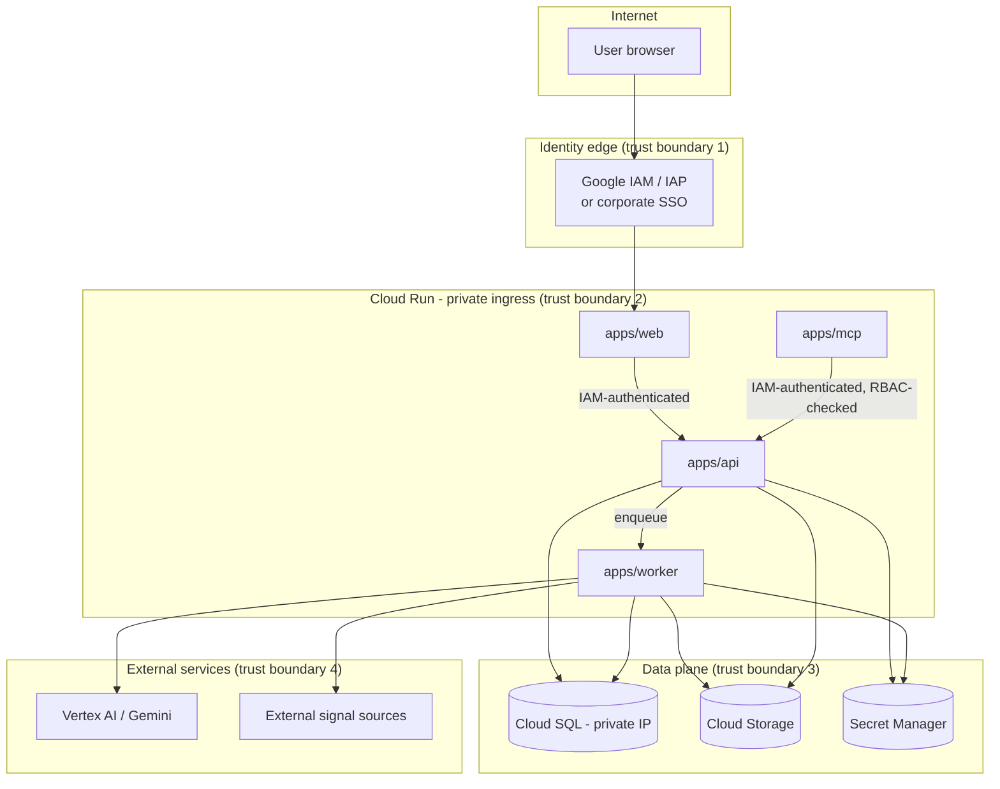

# Threat Model

## Data classification

All risk register content (risk statements, financial impact figures, control weaknesses,
incident details, AI analyses) is classified **Confidential — Enterprise Risk Data**.
User account data (email, role) is **Confidential — Internal**. Object storage evidence
files inherit the classification of the risk/control they attach to.

## Trust boundaries

Nothing in trust boundary 2 or 3 is reachable directly from the internet. `apps/web` is the
only service with a public-facing route, and only behind the identity edge. `apps/mcp` is
reachable only by approved, authenticated MCP clients — never the public internet.

## STRIDE analysis by component

### Identity edge (IAP / SSO)
| Threat | Mitigation |
|---|---|
| Spoofing — forged identity token | Rely on Google-managed IAP or corporate SSO's signed tokens; API independently verifies the token/JWT signature and audience on every request rather than trusting an upstream header blindly. |
| Elevation of privilege — role claim tampering | Roles are looked up server-side from `user_roles` keyed by verified identity subject, never trusted from a client-supplied claim/header. |

### apps/web
| Threat | Mitigation |
|---|---|
| Tampering — XSS injecting scripts via risk statement/notes fields | React's default escaping; CSP headers; no `dangerouslySetInnerHTML` on user content; sanitize on the rare rich-text field. |
| Information disclosure — sensitive data cached client-side | No local caching of risk data beyond in-memory session state; secure, `HttpOnly`, `SameSite` cookies for any session token. |
| CSRF | SameSite cookies + CSRF token for state-changing requests if cookie-based sessions are used; if using bearer tokens from IAP/SSO instead, CSRF risk is substantially reduced but headers are still enforced defensively. |

### apps/api
| Threat | Mitigation |
|---|---|
| Spoofing — service-to-service calls impersonated | IAM-authenticated invoker roles between Cloud Run services in production; no shared static API keys between internal services. |
| Tampering — parameter/body manipulation to bypass RBAC or write unauthorized data | Server-side RBAC dependency on every route (never frontend-only); Pydantic schema validation on all inputs; optimistic-concurrency `version` check prevents blind overwrite. |
| Repudiation — a user denies making a change | Every authoritative write emits an immutable `audit_events` row (actor, timestamp, old/new value, reason, source) that cannot be deleted or altered via the API. |
| Information disclosure — over-broad query returns other departments'/users' data | Role- and scope-aware query filters applied server-side (e.g. department-scoped ownership), covered by the role/access test suite. |
| Denial of service — expensive query or bulk import flooding the API | Rate limiting at the API gateway/Cloud Run level; heavy work (imports, simulations, reports) is always routed to the async worker, never executed inline; pagination enforced on list endpoints. |
| Elevation of privilege — SQL injection | SQLAlchemy parameterized queries exclusively; no raw string-interpolated SQL. |
| Injection via import file (formula injection / malicious CSV/XLSX content) | Import parsing treats cell values as data only (no formula evaluation); file type/size validated before parsing; parsing runs with resource limits. |

### apps/worker
| Threat | Mitigation |
|---|---|
| Tampering — job payload manipulated to run unintended work | Jobs reference IDs into the database, not raw executable payloads; worker re-validates state (e.g. RBAC context recorded at enqueue time) before acting. |
| Information disclosure — sensitive risk data leaked in an AI prompt or logged | `packages/ai` prompt builders are allow-listed to specific fields; secrets and credentials are never included in prompts (enforced by not passing full ORM objects into prompt templates, only explicit projections); structured logs redact known-sensitive fields. |
| Resource exhaustion — unbounded Monte Carlo iterations or oversized reports | Iteration counts capped and validated against a configured maximum; report generation bounded by pagination/limits on included risks. |

### apps/mcp
| Threat | Mitigation |
|---|---|
| Elevation of privilege — MCP tool bypassing RBAC | Every MCP tool call carries the caller's authenticated identity through to the same RBAC checks as the REST API — the gateway is a permissioned client of `apps/api`, not a privileged backdoor. |
| Tampering — arbitrary SQL/filesystem access via a "clever" tool call | No tool exposes raw SQL or filesystem paths; the tool surface is a fixed, reviewed list of domain operations (see brief's MCP tool list). |

### Data plane
| Threat | Mitigation |
|---|---|
| Information disclosure — direct database access | Cloud SQL on private IP only, no public IP; access via IAM-authenticated connections from `apps/api`/`apps/worker` service accounts only. |
| Tampering — direct object storage access/modification of evidence or reports | Cloud Storage bucket IAM restricted to service accounts; signed URLs with short expiry for any client-facing download, never public bucket ACLs. |
| Information disclosure — secrets in source control or images | Secret Manager only; `.env` files git-ignored; no service-account key files exported or committed; container images scanned for embedded secrets in CI. |

### AI provider
| Threat | Mitigation |
|---|---|
| Data exfiltration via prompts | Minimum-necessary field projection into prompts; no PII/credentials; provider-neutral interface means the same guardrail applies to the mock and Vertex implementations. |
| AI output treated as authoritative without review | Enforced at the schema level: AI can only write to `ai_suggestions` with `human_review_status = pending`; the only path to changing `risks`/`controls` is the normal authenticated, audited update path, triggered by a human "approve" action. |
| Prompt injection via ingested content (emerging-risk signals, risk notes) causing the AI to produce misleading recommendations | AI outputs are always advisory and human-reviewed before becoming authoritative; emerging-risk candidates require human lifecycle transition; outputs are labeled AI-generated with model/prompt version for scrutiny. |

## Out of scope for this development environment

This session does not create GCP resources, IAM bindings, service-account keys, or
Terraform state — those are Milestone 11 activities executed from the separate corporate
workstation. No real credentials exist in this repository or environment.
